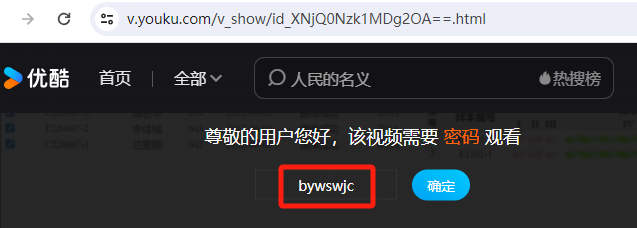

# 简介

## 功能
```
该软件是一款基于三代Nanopore长度长测序平台的宏基因组分析软件，用于对测序产生的fast5文件进
行一系列处理分析，最终呈现出检测样本中的病原微生物信息。

```

## 技术栈
```
该软件基于django框架开发
```

## 部署
```
采用docker镜像部署
```

## 演示

### 第一部分
```
视频播放密码：bywswjc
演示视频链接：https://v.youku.com/v_show/id_XNjQ0Nzk1MDg2OA==.html
```
<a href="https://v.youku.com/v_show/id_XNjQ0Nzk1MDg2OA==.html">演示视频播放</a>

<video width="320" height="240" controls>
  <source src="static/demo/part1.mp4"  type="video/mp4">
  您的浏览器不支持 HTML5 video 标签。
</video>


### 第二部分



